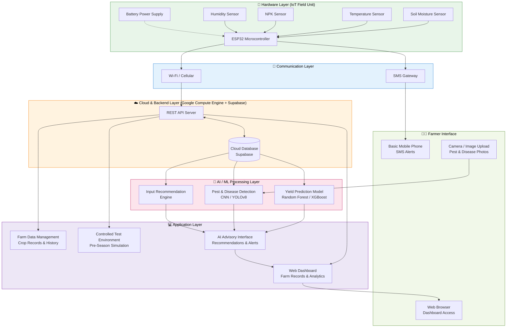

# AI-Driven Platform and Hardware System for Ghanaian Agriculture
## System Architecture

---

## Architecture Diagram



---

## Component Descriptions

### 1. Hardware Layer (IoT Field Unit)
The physical sensing unit deployed in the farm or controlled test environment. An **ESP32 microcontroller** (USD 3–8) aggregates readings from:
- **Soil Moisture Sensor** — detects water levels to trigger irrigation alerts
- **Temperature Sensor** — monitors ambient and soil temperature
- **NPK Sensor** — measures Nitrogen, Phosphorus, and Potassium levels
- **Humidity Sensor** — tracks atmospheric moisture

The ESP32 was selected for its dual-core processing, built-in Wi-Fi/Bluetooth, and low power draw (~240 mA), making it ideal for resource-constrained field deployments.

---

### 2. Communication Layer
- **Wi-Fi / Cellular** — transmits sensor data to the cloud backend with latency as low as 1.18 seconds and uptime above 99%.
- **SMS Gateway** — sends real-time threshold alerts (e.g., critically low soil moisture) directly to farmers' basic mobile phones, requiring no internet connection.

---

### 3. Cloud & Backend Layer
- **Google Compute Engine** — hosts the application server and AI inference services.
- **Supabase** — provides the cloud database for storing farm records, sensor readings, user data, and historical seasonal data.
- **REST API Server** — mediates communication between the frontend, database, and AI models.

---

### 4. AI / ML Processing Layer
| Module | Algorithm(s) | Purpose |
|---|---|---|
| Yield Prediction | Random Forest, XGBoost, LSTM | Forecast crop yields from soil, climate, and management data |
| Pest & Disease Detection | CNN (MobileNet, ResNet), YOLOv8 | Classify and locate pests/diseases from uploaded images |
| Input Recommendation Engine | Random Forest, Gradient Boosting | Recommend seed variety, fertilizer type, and planting time |

---

### 5. Application Layer
- **Web Dashboard** — visualises sensor readings, farm analytics, and AI recommendations.
- **Farm Data Management** — enables digital recording of crop records, seasonal history, and financial data.
- **Controlled Test Environment** — allows farmers to simulate crop seasons and input choices before committing real resources.
- **AI Advisory Interface** — aggregates outputs from all AI modules into actionable, farmer-friendly guidance.

---

### 6. Farmer Interface
- **Basic Mobile Phone (SMS)** — receives real-time sensor alerts and weekly advisory summaries; works without internet or smartphones.
- **Web Browser** — provides access to the full dashboard for farmers or extension officers with internet access.
- **Camera / Image Upload** — farmers photograph crop symptoms; images are sent to the pest and disease detection model.

---

## Data Flow Summary

```
Field Sensors → ESP32 → Wi-Fi → Cloud API → Database
                       ↓
                  SMS Gateway → Farmer's Phone

Database → AI Models → Recommendations → Web Dashboard → Farmer
Farmer Camera → Disease Detection Model → Diagnosis + Guidance
```

---

## Key Design Principles
- **Affordability** — built on low-cost hardware (ESP32) and open/affordable cloud tools
- **Offline-friendly** — SMS alerts function without internet; designed for low-connectivity rural Ghana
- **Locally adapted** — AI models trained on Ghanaian crop and soil data (tomato, cabbage, maize)
- **Integrated** — combines IoT sensing, farm records, yield prediction, pest detection, and advisory in one platform
- **Accessible** — web dashboard for connected users; SMS fallback for all others
